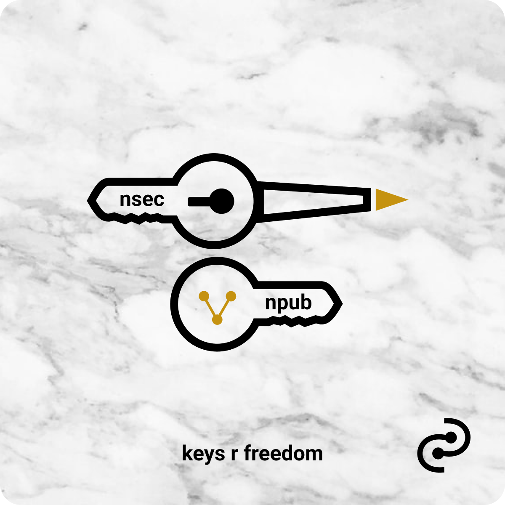

# freedom
<!-- excerpt ends before this -->

## freedom vs. control

Technology, including the internet, has opened new worlds for connecting and empowering people across the globe. It is as if we have gained access to new dimensions and dissolved barriers between us.

These dimensions are a reflection of humanity. As you dive deeper into how technology has been shaped and reshaped, you often discover widespread practices of dominant global societies with central organizations who decide the rules and the access. This leaves space for greed, censorship, corruption, data amassing, privacy infringement, and other practices that forgo a foundation on human rights for a foundation on control and maximum profit.

It is a paradox and a mystery to think that those in power can institute policies that can infringe on their own rights.

As some build on control, surveillance, and maximum profit, others build on the idea that "information wants to be free." In many ways, it not only wants to be free, it seeks to be freeing. It can be built on freedom, love, and individual rights. A challenging frontier, empowering technology calls upon each person to be responsible over our own lives.

If you have lived under authoritarian rule, if you have experienced the ravages of war, if you have experienced the hardships of spiking inflation, if you have been censored for using your voice to defend human rights, if your bank account has been closed or worse for supporting a protest, if you've been persecuted for being different, the choice of personal freedom through responsibility is simple.

Technology is growing to allow personal responsibility and control over your own money (bitcoin), identity (nostr, web5), privacy (DIDs)... 

It gives you the keys to make choices over your own life, a freedom we did not know we had lost.
