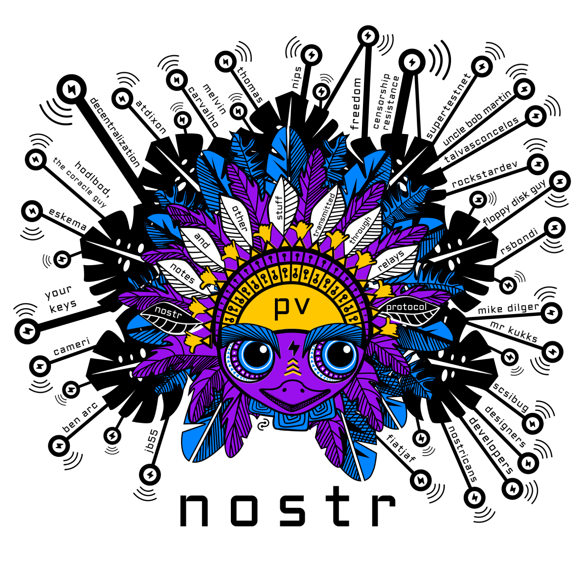
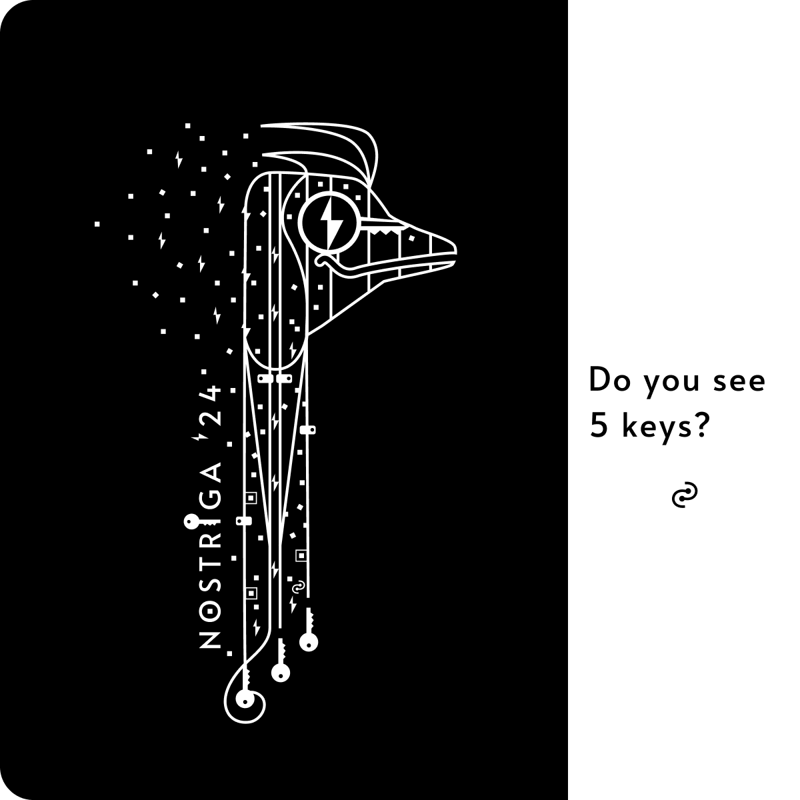

# What it means to own your keys.

**Thoughts on the freedom of removing third parties.** 

<!-- excerpt ends before this -->

---

## What do you see? Keys.
*2024·April·03*

We all learn through observation, imitation, practice, mistakes, and more practice. We learn by comparing and contrasting what we see in the world, in order to imagine what we wish it could be. At core, we long for something that defines us and adds meaning to our daily lives. 

Copycat imitation is not interesting. A custom creative journey is.

Some say, experience gives you a unique style, as you learn the tools. Experience, however, opens a myriad of possible roads to create art. You may relate to that as knowing how to shape and reshape a coding language for your various needs and purposes. The deeper you learn and test how programming languages work, the wider array of choices on what and how to create. While in code you may seek efficiency and simplicity, in art, people often seek a recognizable look. 

If you see some of my latest artwork, you might say there is a look, but the reality is different if we look across time. Art can vary widely, even wildly, depending on both purpose and media. 

If I do not hope for a recognizable look, what is it that I hope for?

   

*nostr spirit*

 

If we only look at the quality of the code or the style of the art, we are often holding a boxed-in perspective. Take nostr, for example, you could compare it with other social media and criticize it solely on how a single client looks and feels compared to what you have experienced elsewhere. Based on that sole known concept, some may see nostr as "not quite the same", as if something was missing: their people. But are people locked-in their previous apps forever?

That depends on how you see nostr, just like it depends on whether you understand the story behind the art. For me, switching to only nostr was simple, but I went down the rabbit hole. I feel more grateful everyday for all the qualities that make nostr different: Yes, it's also about the people. 

The people on nostr are shaping what it becomes on every layer: Code, design, UX, content, and beyond. You do not get that anywhere else. It is not advertisements nor algorithms built for advertisers or data buyers that make the decisions. We make the decisions, as part of a larger community. Hence, we are free to contribute to building what fits us best. 

Over time, I realized I do not want the engagement farming, the unethical data gathering, the possibility of having my account cancelled because I think different. I am only on nostr. The only other account I keep is Pinterest, but not on a social level. I hope one day, nostr will have as much content to discover. It depends on us to make it what we wish it to be. 

What nostr solves for is not the same as other social media. You own your nostr on so many levels. Your keys give you access to any app on the nostrverse, along with all of your notes, follows and followers. It's a compact suitcase, but it fits so much. For content creators, it opens the door to micropayments through zaps. This value4value support is not based on advertisements, it is a direct link to your audience, and the specific content they appreciate. Signal over noise.

### Easter eggs

I keep digging deeper into what is at the core of freedom tech and how it inspires us, as a community. Over the years, I have often added small details with personal meaning to art, a sort of Easter egg. Not the kind of Easter egg that would be noticed nor understood, looking from the outside in. Freedom tech, however, is an open community with various symbols adding meaning to our everyday lives. Naturally, the Easter eggs have continued, but in a way that you, the observer, can discover and understand.

 

*pura vida*

 

When people dismiss technology like Nostr or Bitcoin, it’s often because they do NOT see what makes them special. I’d like art to reflect the idea that some people do NOT see, but for those who do, it is something meaningful and empowering. Perhaps, even when you do NOT know the meaning behind it, it will spark your curiosity to find out why it’s there. 

Take this <a href="https://shop.nostr.build/products/nostriga-24-tshirt-elidy" target="_blank" alt="Nostriga t-shirt design at nostr.build shop">Nostriga t-shirt design</a>, for example. It carries keys. Five of them. You will spot four of them easily, but the fifth one… that may be a bit of a surprise. For those who understand the value of owning your keys, and hence your nostr, you will see more than five keys there. You will see **why keys matter**, and that, cannot be seen with the eyes.

 

<a href="https://shop.nostr.build/products/nostriga-24-tshirt-elidy" target="_blank">
Nostriga t-shirt @ shop.nostr.build</a>

 

It is not the style, but sharing with our people the meaning and principles behind it that makes all the **other stuff** special.

  

---

## Support loop

*unknown date*

Nostr exists outside of the rule of platforms and those who seek to control them. HODLing your nostr keys is hodling your identity and social graph, outside of KYC. By helping develop nostr, you are helping people escape walled gardens & gain control and choice over their identities & have a path to value4value. By using nostr, you are supporting that which supports your freedom of expression. 

  

___

## HODL Keys

*unknown date*

Keys are interweaved into our daily lives. They open milestones and memories:

Home keys

         Music keys

  Car keys

                Key ingredients

  Keyboard keys

          Click, 
               click, 
                  click

  nostr keys

           bitcoin keys...

If you are familiar with bitcoin, you may realize it can empower you to have full control over your money, without intermediaries of any kind… as long as you have your keys and keep them safe.
Just like your house keys, if you leave your bitcoin where others have the keys, you run the risk of losing what you have. Bitcoin can be different, you can choose to take full responsibility of it, though that may take an open mind and a lot of diving into deeper and deeper rabbit holes.

We have learned to keep our home keys safe and where we can find them (hopefully). We keep them away from those we do not trust. Bitcoin is similar though it also means being open to learning, open to trial and error, and open to feeling the freedom of empowerment.