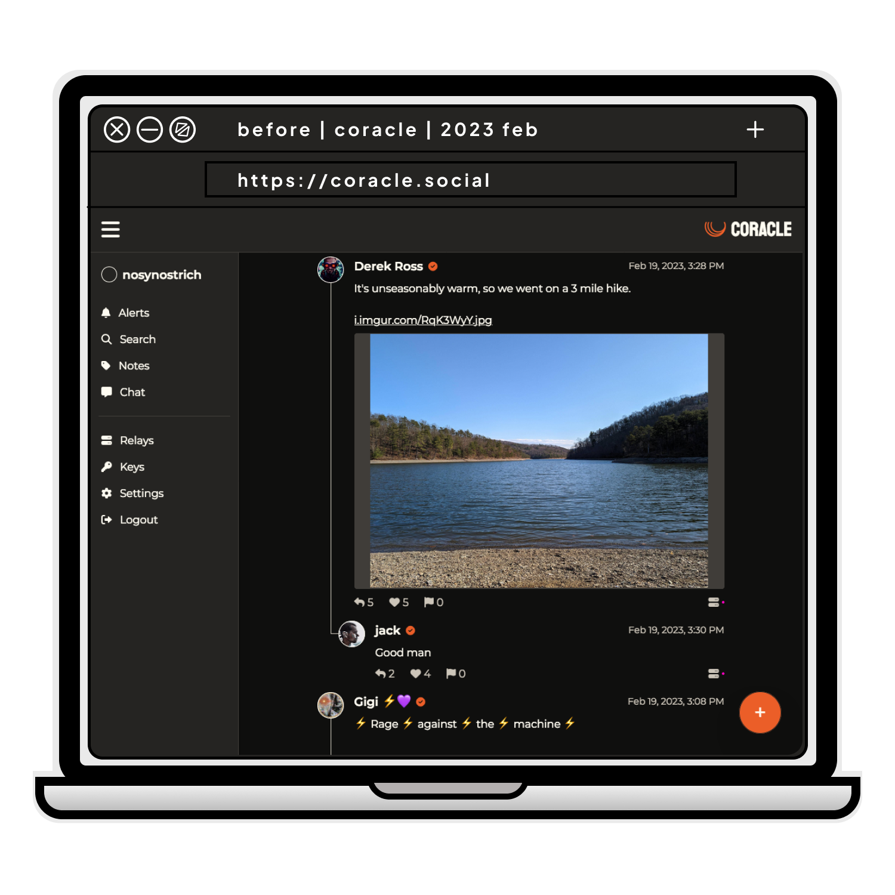
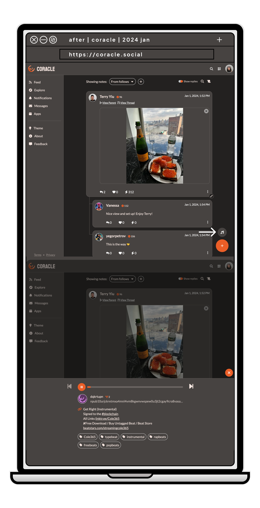
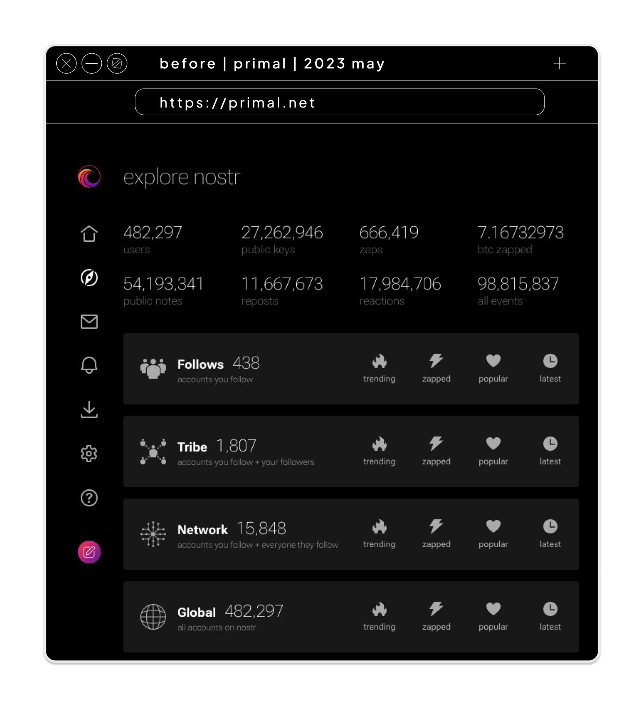
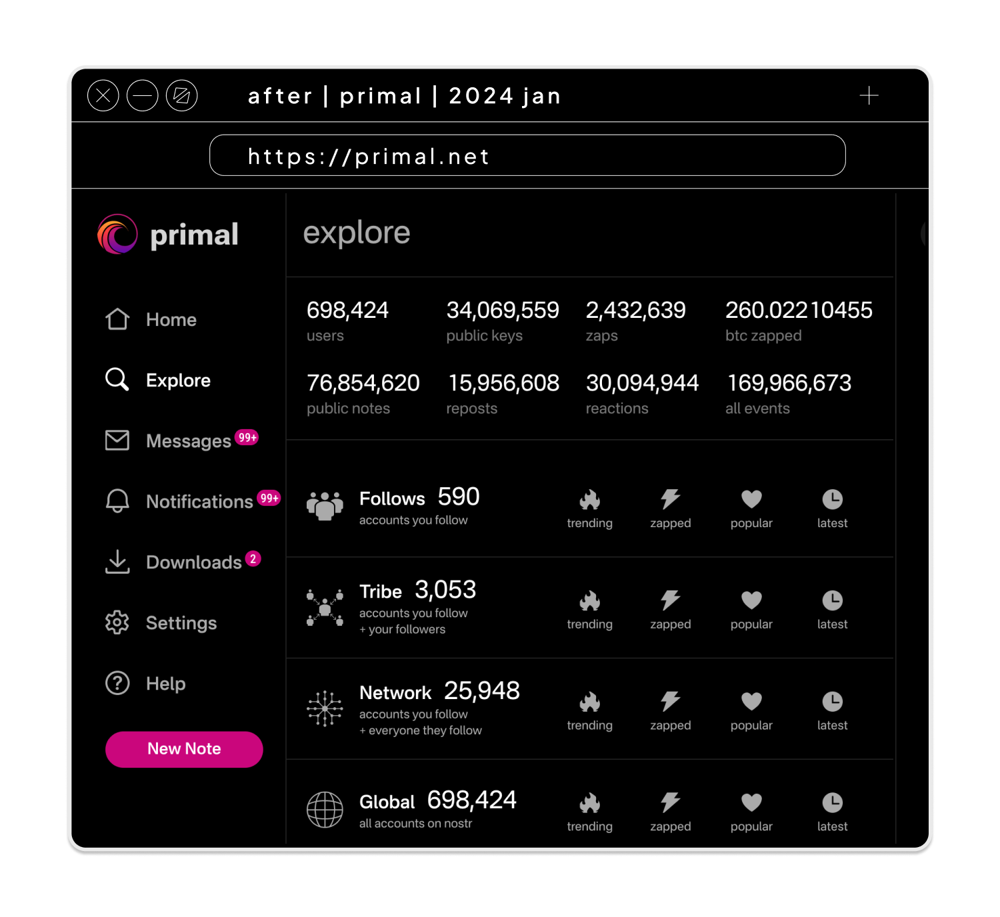

# nostr in time
## before and after

**Looking at nostr client progress.** 

<!-- excerpt ends before this -->

On our day to day use of nostr, it is easy to lose track of the many improvements and unique experiences it offers. If we look back in time, we can see how much some nostrverse projects have grown. This is a field trip to document those changes across time.

 **field trip focus**

- differentiating features
- interoperability
- zaps & value4value
- tools for content creators  

## follows are nostr's algorithm
### Coracle
developer: [hodlbod@coracle.social](https://nostr.com/npub1jlrs53pkdfjnts29kveljul2sm0actt6n8dxrrzqcersttvcuv3qdjynqn)

*differentiating feature:* **music**

One of the best features in nostr is showing content based on who you follow and who your follows follow (a.k.a. your network). It helps focus on your interests, and it reduces spam. While, in the future, nostr clients may offer choices in algorithms to curate content, it is good to always have the option to see content based on who and which topics you follow. You are the curator. 

Coracle has taken a unique approach to this. It now has a button that finds music on nostr from your network. You can listen to that music while you look through your notes. 

Have a favorite musician on nostr? [Let me know.](https://nostr.com/npub1a7n2h5y3gt90y00mwrknhx74fyzzjqw25ehkscje58x9tfyhqd5snyvfnu)

#### before (early 2023)

#### after (early 2024)

## what constitutes growth?

### Primal
developer: [miljand@primal.net](https://primal.net/p/npub16c0nh3dnadzqpm76uctf5hqhe2lny344zsmpm6feee9p5rdxaa9q586nvr)

*differentiating feature:* 
**tracking network effects**

Nostr offers the possibility of developing various curation tool choices.
Primal already offers insights into nostr's network effects across time through its explore tab and trending users. 

How could we go deeper? Could we see top posts from within our follows or topics?

What is the best metric? Zaps? Could we see what is most replied to by our follows? What are the most followed hashtags?

How could we better understand growth, not just in terms of the amount of people trying nostr, but on who is staying and engaging much deeper and why?

#### before (may 2023)

#### after (january 2024)

