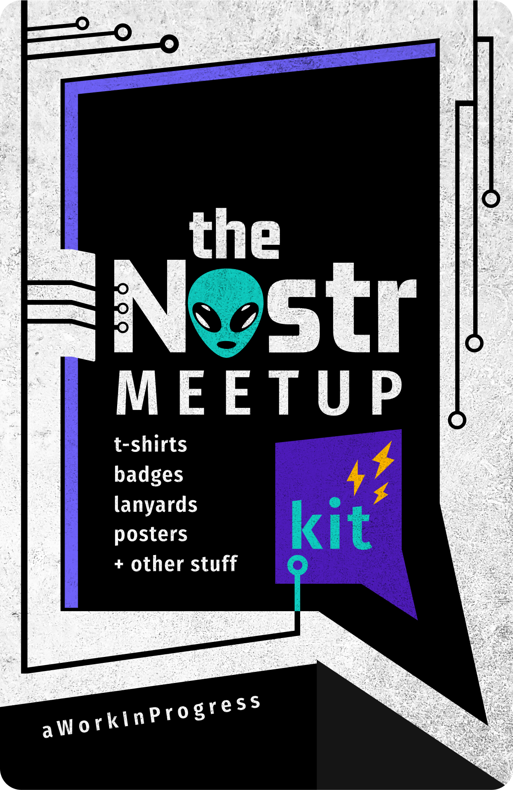
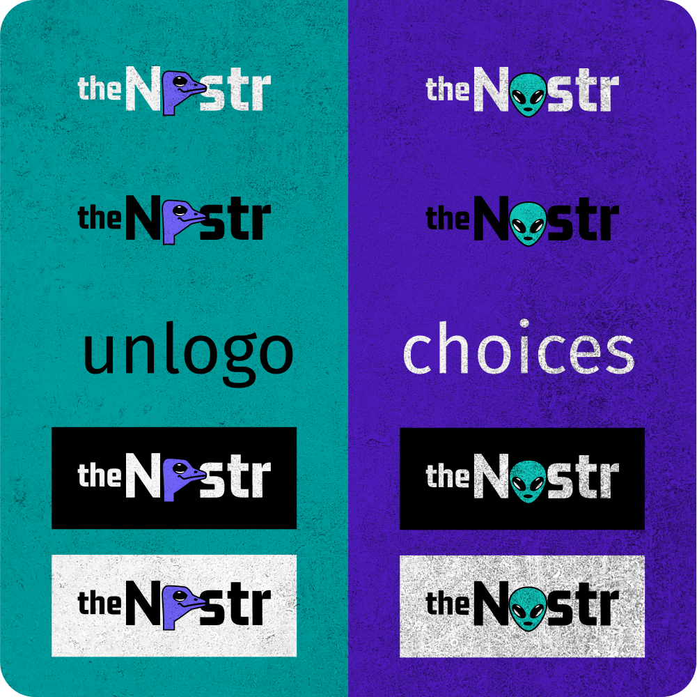
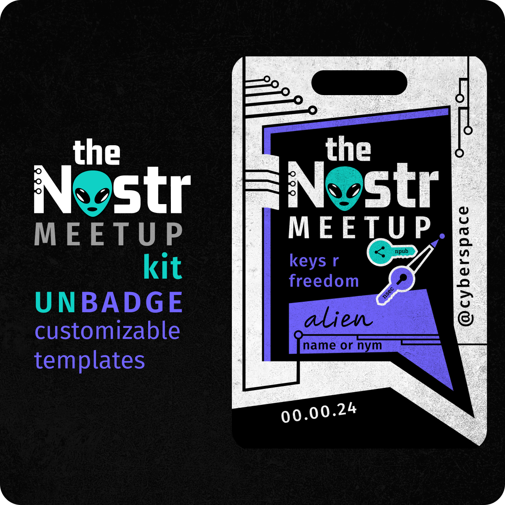
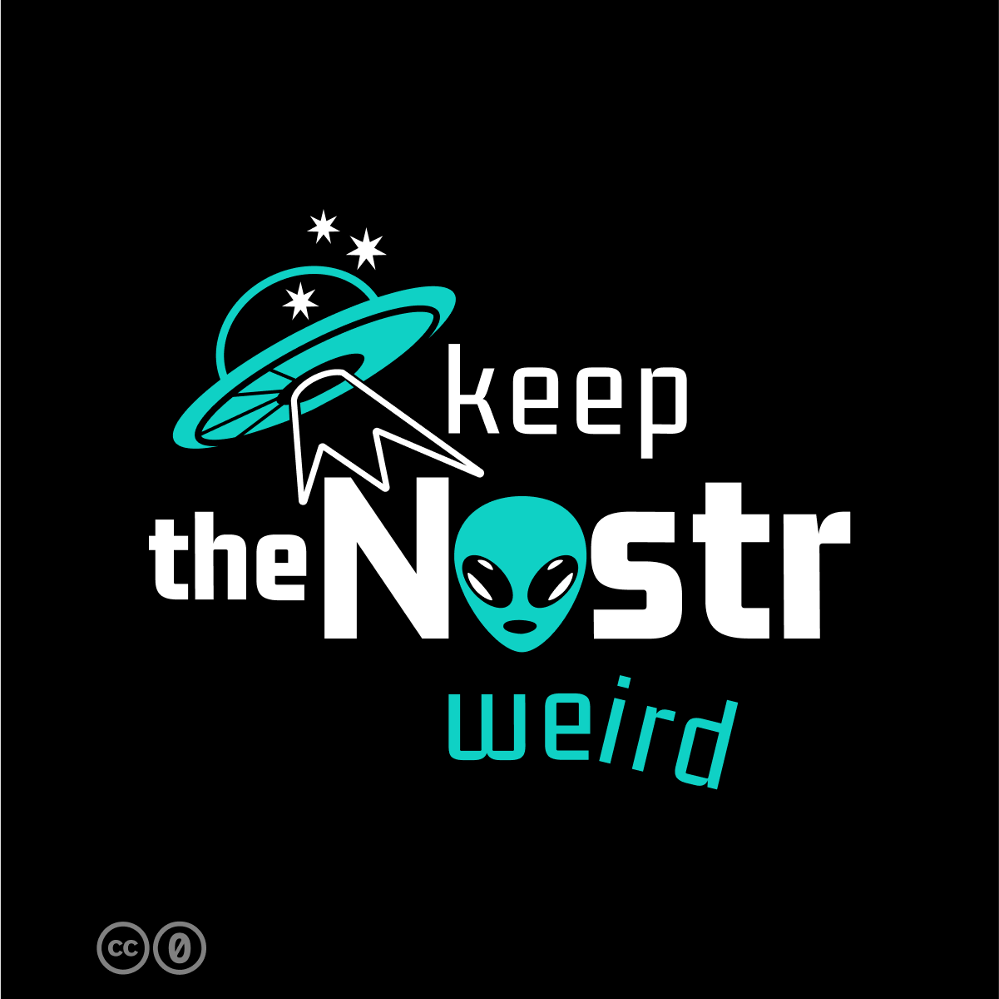

# the Nostr meetup kit

**vector graphics and templates to make coming together meaningful**

One of the freedoms of nostr is that it has no rulers to dictate what it should look like. Having no centralized company to decide on the brand for nostr, means you have a personal choice on how to represent your nostr.

<!-- excerpt ends before this -->

[editable files on Figma](https://www.figma.com/community/file/1335001378663601894/the-nostr-meetup-kit){ .md-button .md-button--primary }

## the unlogo

## the unbadges

## the untshirts

## the unstickers

[editable files on Figma](https://www.figma.com/community/file/1335001378663601894/the-nostr-meetup-kit){ .md-button .md-button--primary }

