# the Nostr unlogo

## to nostrich or not to nostrich

How do you answer a question with no right or wrong answer? You do so with choices. Hence the unlogo is not just one version. For now, it applies two different cultural symbols from the nostr community: the nostrich and the alien.

<!-- excerpt ends before this -->

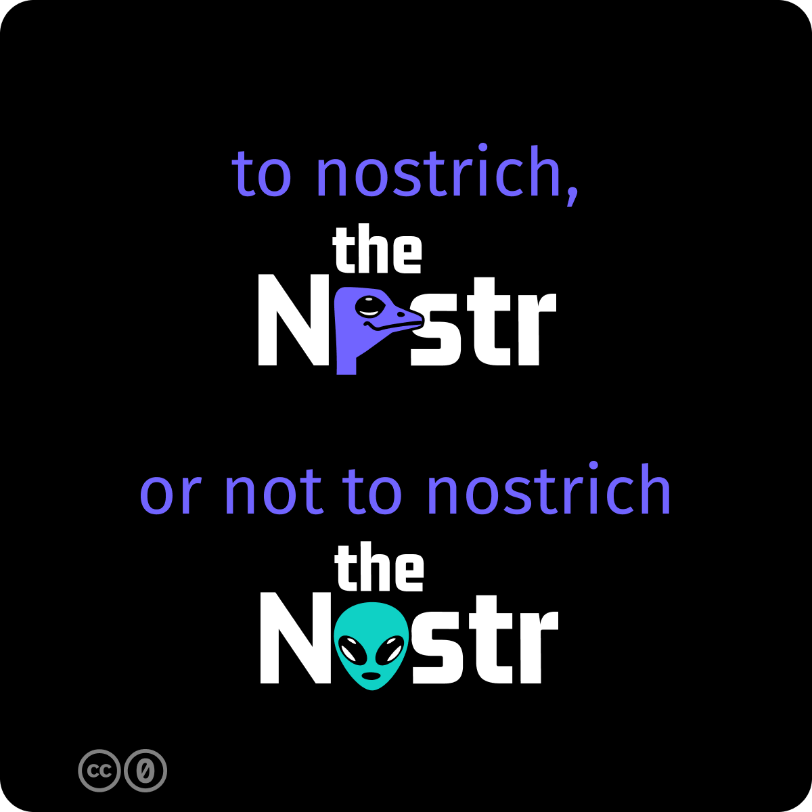

[editable files on Figma](https://www.figma.com/community/file/1335001378663601894/the-nostr-meetup-kit){ .md-button .md-button--primary }

## logo files

You may use these nostr logos freely, if they resonate with you. 

Find the .svg & .png files below.

### nostrich nostr logo

**spacing**

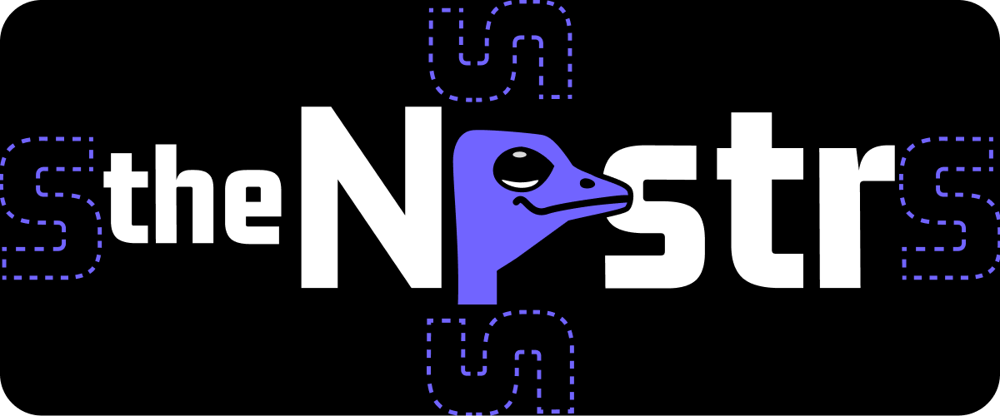

**svg's**

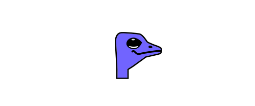

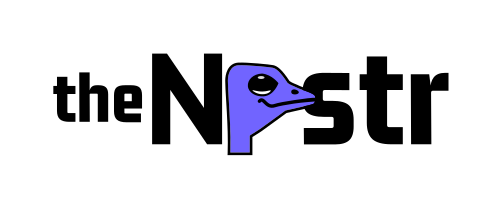

**png's**

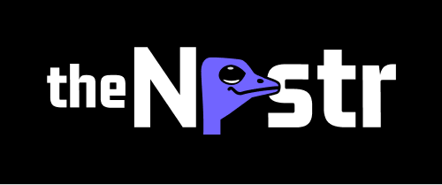

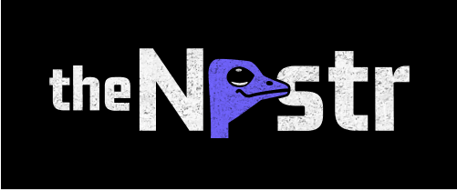

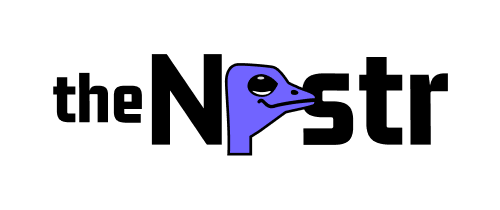

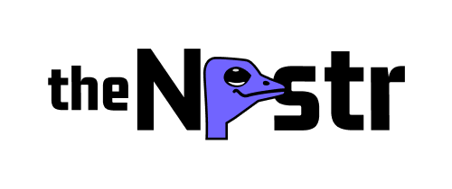

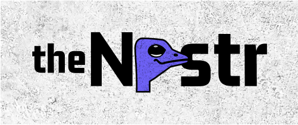

### alien nostr logo

**svg's**

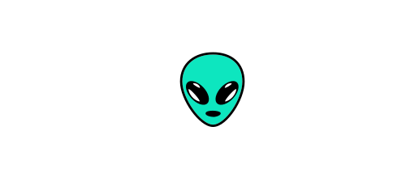

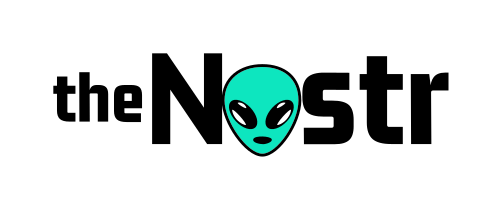

**png's**

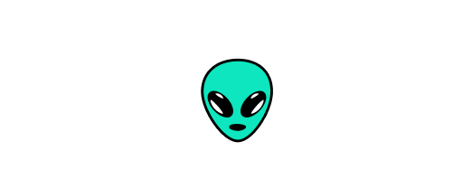

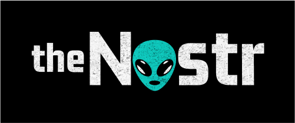

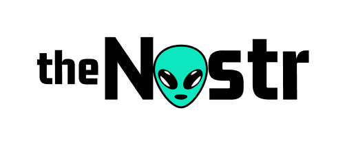

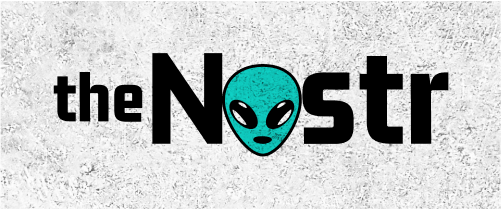

## icons

The nostr nostrich and nostr alien icon designs carry the same purple background for uniformity. 
The smaller sizes reduce details for clarity.

256x256

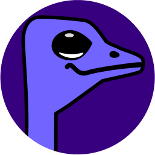
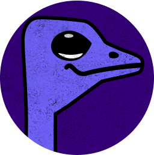

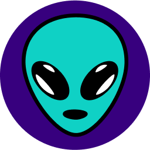
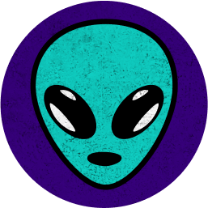

180x180

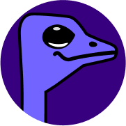
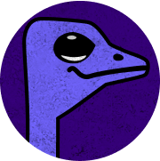

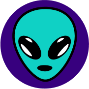
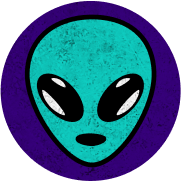

150x150

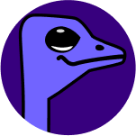
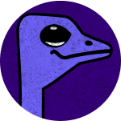

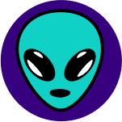
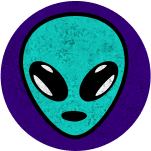

72x72 (svg)

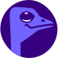

48x48 (svg)

32x32 (svg)

16x16 (svg)

[editable files on Figma](https://www.figma.com/community/file/1335001378663601894/the-nostr-meetup-kit){ .md-button .md-button--primary }
