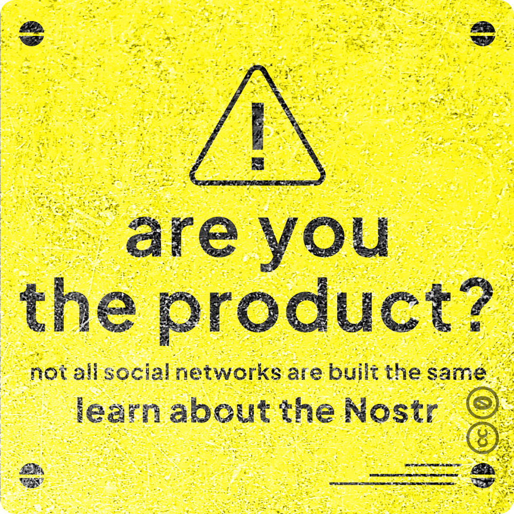
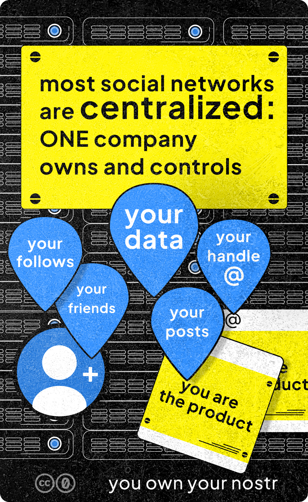
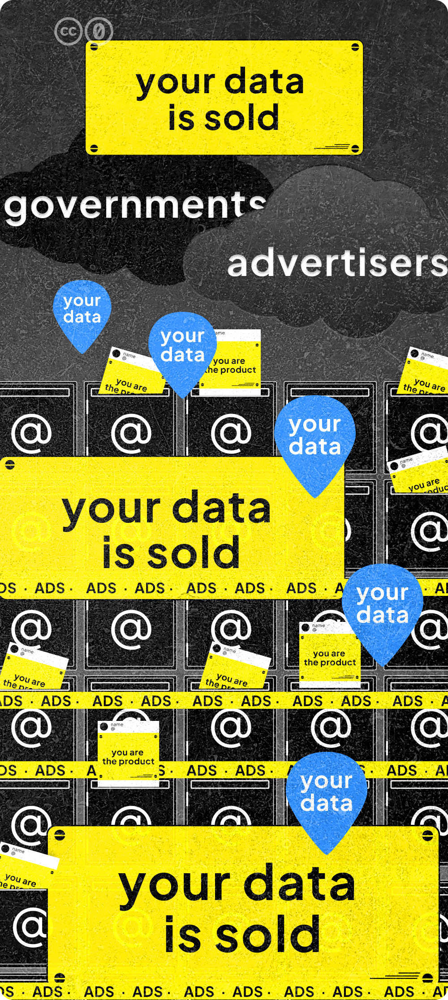
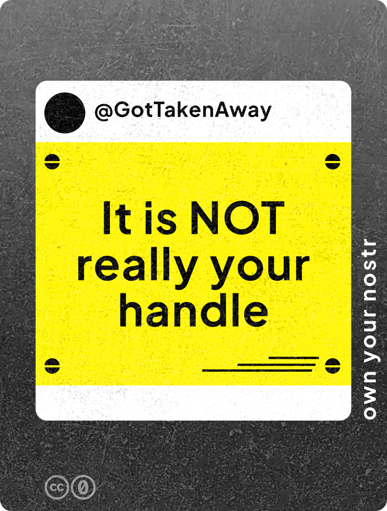
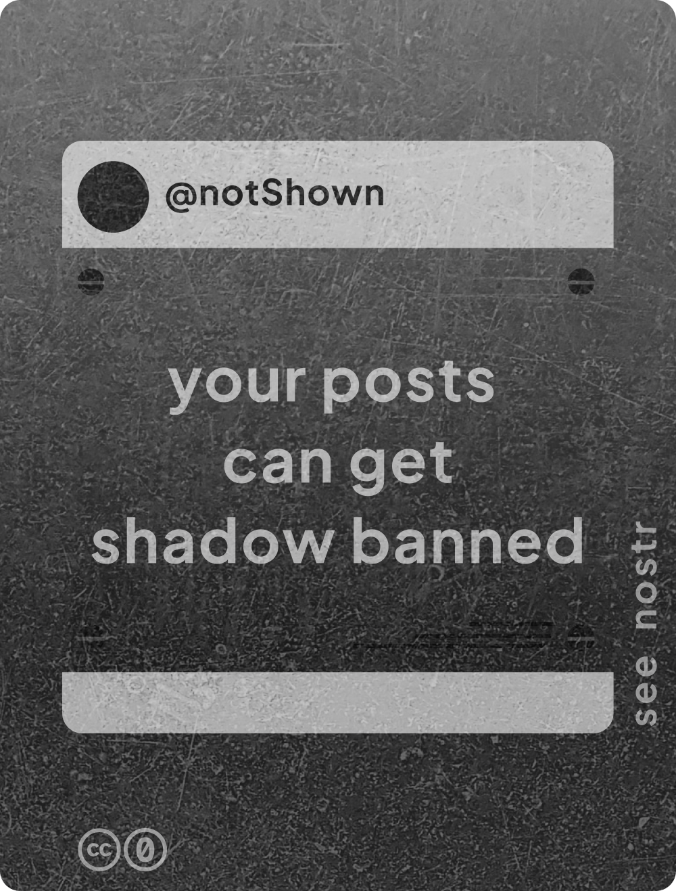
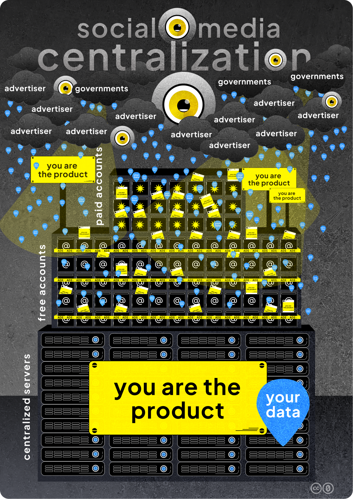

# are you the product?
## you are NOT the product on nostr

In a social media landscape where your data is sold to advertisers and can be given to governments (concerning if you're a journalist, activist, have minority points of view...), the Nostr is a refreshing alternative.

## But why? What can go wrong with other social networks? 

<!-- excerpt ends before this -->

**2B continued...**