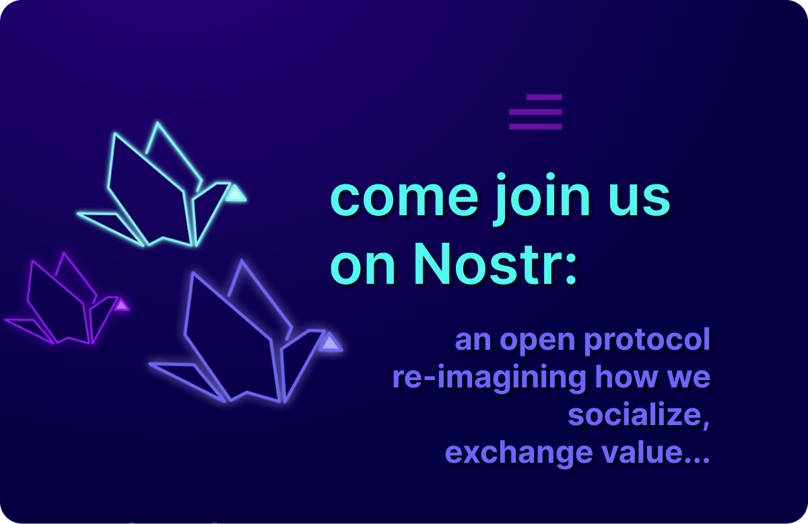
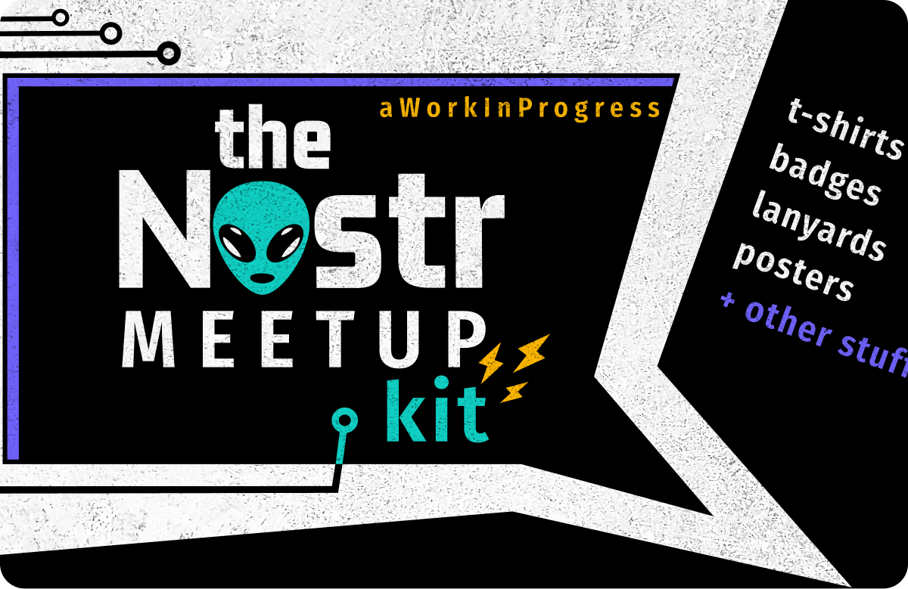
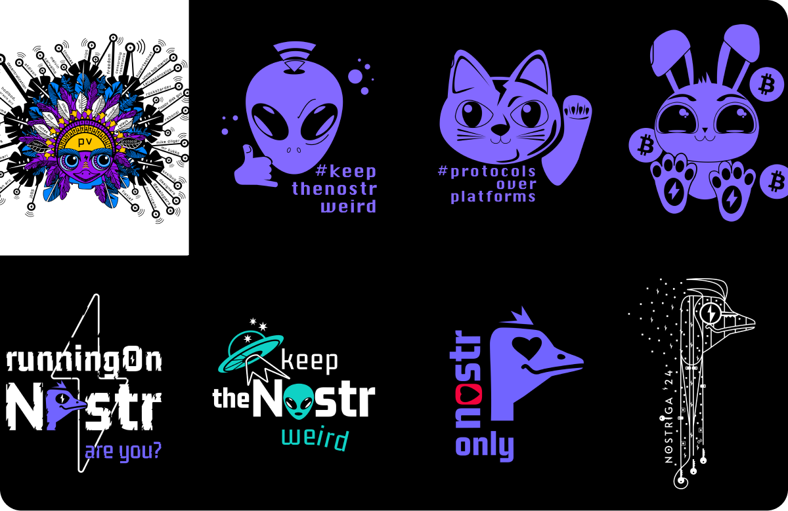

# Now and then

Love is the foundation for tools valuing freedom, choice, and personal autonomy.

This is a field trip into the why behind freedom tech.

Don't trust, verify.

<!-- excerpt ends before this -->

## Now

### Sci-fi post-apocalyptic story

Research and writing phase. 

**Over the next few months, I’ll be exploring our cyberspace for those technological gifts and their nemesis. These discoveries will shape the base layers for a post apocalyptic science fiction story showing where those two paths could lead…** 

Through an open behind the scenes process, I'll be sharing thoughts and tips, asking questions, and creating open UX #design resources as I test and learn more about the why behind the tech.

The primary tech focus will be on #bitcon, #nostr, and their symbiosis. I'll be taking the writing aspect of storytelling and making it come alive through #art, 3D modeling, #music, and animation.

Come along this creative journey as the story gets weaved, along with smaller, educational, yet kind of fun pieces.

## Find me on nostr only

elidy

npub1a7n2h5y3gt90y00mwrknhx74fyzzjqw25ehkscje58x9tfyhqd5snyvfnu

### Blogging on Nostr

Behind-the-scenes

<a href="https://highlighter.com/npub1a7n2h5y3gt90y00mwrknhx74fyzzjqw25ehkscje58x9tfyhqd5snyvfnu" target="_blank">&#8594; Highlighter</a>

### Nostr.org

Contributing to design and copy on splash page to welcome people to nostr

<a href="https://github.com/lnbits/nostr.org" target="_blank">&#8594; On GitHub</a>

<a href="https://github.com/lnbits/nostr.org/pull/15" alt="version 2.0 of nostr dot org, PR on GitHub" target="_blank">&#8594; Version 2.0 coming soon, PR on GitHub</a>

### Nostr Meetup Kit

### Behind the t-shirt designs: What do you see?

<a href="https://shop.nostr.build/products/nostriga-24-tshirt-elidy" target="_blank">&#8594; Latest design available on shop.nostr.build</a>

## Then

### Keep the Nostr Weird

<a href="https://youtu.be/0m4EGMpm29o" alt="Nostrasia Keep the Nostr Weird" target="_blank">On YouTube</a>

### Bitcoinostr: A Symbiosis 

<a href="https://youtu.be/BZL58Uor3GQ" alt="Nostrasia Keep the Nostr Weird" target="_blank">On YouTube</a>

